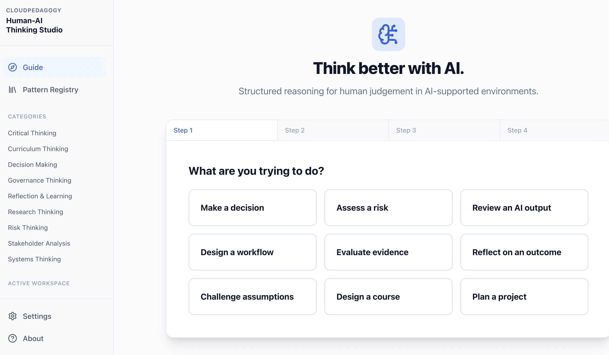

# CloudPedagogy Human–AI Thinking Studio

A local-first, browser-based tool to help users think more effectively with AI through structured reasoning patterns rather than prompt engineering.

This application is fully static, running entirely in the browser using React, Zustand, and Tailwind CSS. All data (including user sessions, custom patterns, and settings) is stored securely in your browser's LocalStorage.

🌐 Live Hosted Version

http://cloudpedagogy-human-ai-thinking-studio.s3-website.eu-west-2.amazonaws.com/

🖼️ Screenshot



## Getting Started

1. Install dependencies:
   ```bash
   npm install
   ```

2. Start the development server:
   ```bash
   npm run dev
   ```

3. Build for production (outputs static files to `/dist`):
   ```bash
   npm run build
   ```

## Pattern Registry & Importing

The Pattern Registry is fully data-driven. This means that **categories and patterns are generated entirely from data.** You can easily extend the application without writing any code by importing JSON Pattern Packs.

### How to Import a Pattern Pack

1. Navigate to the **Pattern Registry** from the sidebar.
2. Click the **"Import Pack"** button in the top right.
3. Select your JSON pack file (e.g., `sample-pattern-pack.json`).
4. The system will prompt you to choose an import strategy:
   - **`keep`**: Only imports new patterns that have a unique ID.
   - **`merge`**: Updates existing patterns if the ID matches, and imports new patterns.
   - **`replace`**: Deletes your current library and replaces it entirely with the imported pack.

### Dynamic Categories

When you import a pattern pack, any new categories specified in the JSON file will be instantly added to the application. 
- A new link will appear under "Categories" in the left sidebar automatically.
- The new category will be selectable in the filter dropdown on the Pattern Registry page.
- No code changes are required!

*(You can test this by importing the included `sample-pattern-pack.json` which adds a new "Strategic Foresight" category).*

## Exporting Packs

You can also export your current library of custom patterns by clicking **"Export Pack"** in the Pattern Registry. This generates a JSON file that you can share with others.

## Licence

This project is released under the MIT Licence.

Part of the CloudPedagogy Governance Engineering ecosystem.

